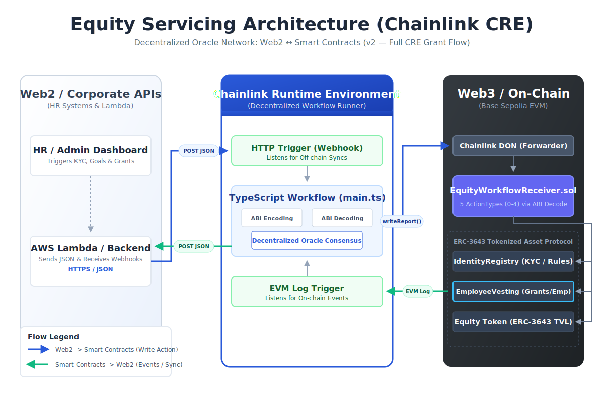
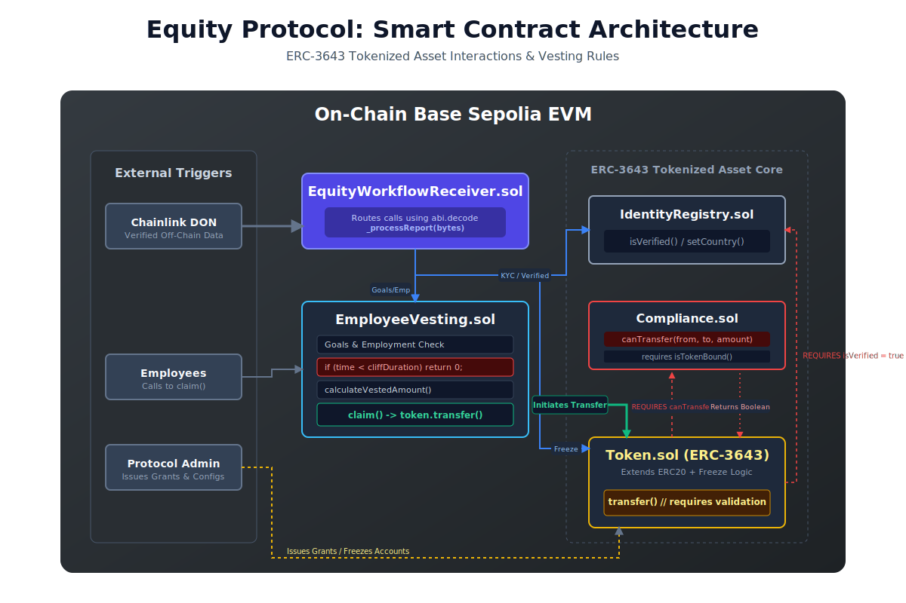
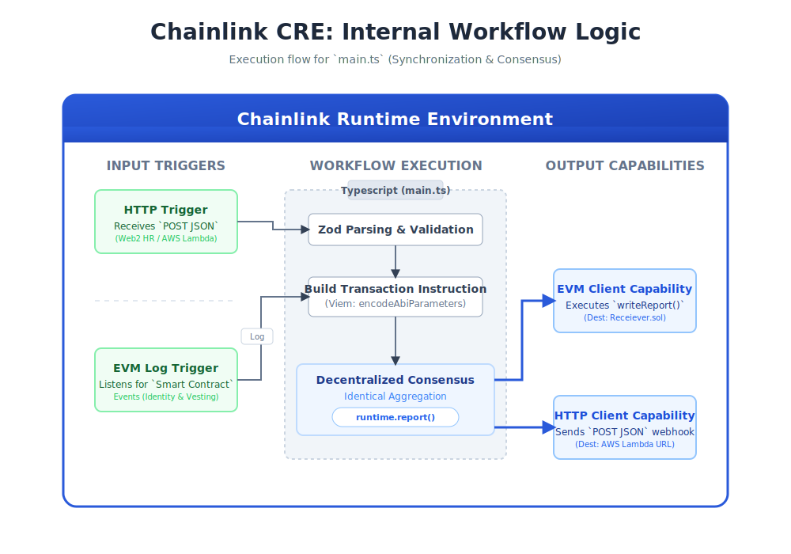

# Chainlink CRE Equity Servicing Workflow

This repository demonstrates the integration of the **Chainlink Runtime Environment (CRE)** to enable bidirectional synchronization between off-chain Web2 systems (such as HR databases or AWS Lambda functions) and an on-chain **ERC-3643 Equity Protocol**.

By leveraging Chainlink CRE's **LogTrigger** and **HTTP Abilities**, the architecture seamlessly orchestrates Web2 data changes to the blockchain and captures on-chain events for off-chain persistence, tracking the full lifecycle of tokenized equity and grants without sacrificing true decentralization.

## Architecture

The project relies on a comprehensive architecture that delegates responsibilities across Web2 infrastructure, the Chainlink Decentralized Oracle Network (DON), and Web3 Smart Contracts on the Base Sepolia network.

### 1. Equity Servicing Architecture (End-to-End)



This diagram visualizes the overarching integration:
- **Web2 / Corporate APIs**: HR dashboards and Lambda functions serving as the source of truth for employee data.
- **Chainlink CRE (Decentralized Workflow Runner)**: The `main.ts` TypeScript workflow that handles ABI encoding/decoding and decentralized consensus, listening to both HTTP APIs (outbound Web2) and EVM Logs (inbound Web3).
- **Web3 / On-Chain**: The receiver contract routing data to the core ERC-3643 asset protocol.

### 2. Smart Contract Architecture (Solidity)



The on-chain layer (`contracts/equity-protocol`) consists of an implementation of the **ERC-3643 Tokenized Asset standard**, customized for equity vesting:
- **`IdentityRegistry.sol`**: Manages KYC status and geographic compliance (`setCountry`, `isVerified`).
- **`EmployeeVesting.sol`**: Governs employee stats, goal achievements, and vesting schedules. Includes the `claim()` logic which initiates transfers.
- **`Token.sol` (ERC-3643)**: The core equity token with built-in transfer validation and wallet freezing capabilities.
- **`Compliance.sol`**: Enforces strict `canTransfer` rules before token transfers are approved.
- **`EquityWorkflowReceiver.sol`**: The entry point for Chainlink CRE transactions (`writeReport(bytes)`), routing the ABI-decoded instructions to the appropriate protocol contracts.

### 3. Chainlink CRE Internal Workflow Logic



The Chainlink CRE workflow (`EquityWorkflowCre/main.ts`) runs a two-way synchronization bridge:
- **Web2 to Web3 (HTTP Trigger $\rightarrow$ EVM Client)**: 
  A webhook (`POST JSON`) is received by CRE containing operations like `SYNC_KYC` or `SYNC_EMPLOYMENT_STATUS`. It is validated via Zod, compiled into a transaction instruction, processed through decentralized consensus, and finally broadcast to the `EquityWorkflowReceiver.sol` on-chain.
- **Web3 to Web2 (EVM Log Trigger $\rightarrow$ HTTP Client)**: 
  Smart contract events such as `GrantCreated`, `TokensClaimed`, or `IdentityRegistered` trigger the workflow. CRE decodes the logs and forwards the structured event data as a webhook to the AWS Lambda backend for DynamoDB persistence.

## Supported Sync Actions (Off-Chain $\rightarrow$ On-Chain)

The HTTP Trigger accepts JSON payloads to synchronize corporate states.
Supported actions include:
- `SYNC_KYC`
- `SYNC_EMPLOYMENT_STATUS`
- `SYNC_GOAL`
- `SYNC_FREEZE_WALLET`

Example payload for `SYNC_KYC`:
```json
{
  "action": "SYNC_KYC",
  "employeeAddress": "0x1111111111111111111111111111111111111111",
  "verified": true,
  "identityAddress": "0x2222222222222222222222222222222222222222",
  "country": 840
}
```

## Supported Event Forwarding (On-Chain $\rightarrow$ Off-Chain)

The EVM Log Trigger listens to the following events and `POST`s them to the backend API (`config.url`):
- `IdentityRegistered` / `IdentityRemoved`
- `CountryUpdated`
- `GrantCreated` / `GrantRevoked`
- `TokensClaimed`
- `EmploymentStatusUpdated`
- `GoalUpdated`

## Getting Started

### Prerequisites
- Node.js (v18+) and Bun package manager.
- Chainlink CRE CLI installed and logged in.
- Hardhat / Foundry for deploying the `.sol` protocol.
- Sepolia ETH for gas.

### 1. Deploy the Equity Protocol
Navigate to the `contracts` directory, install dependencies, and run the deployment script. Note the addresses of the deployed `IdentityRegistry`, `EmployeeVesting`, and `EquityWorkflowReceiver`.

### 2. Configure the CRE Workflow
Modify `config.staging.json` inside the `EquityWorkflowCre` directory:
- `url`: Your backend / AWS Lambda endpoint.
- `receiverAddress`: Address of your `EquityWorkflowReceiver.sol`.
- `identityRegistryAddress`: Address of your `IdentityRegistry.sol`.
- `employeeVestingAddress`: Address of your `EmployeeVesting.sol`.

### 3. Simulate Workflow Locally
Run the workflow simulation locally to dry-run changes before committing them on-chain.
```bash
cd EquityWorkflowCre
cre workflow simulate ./EquityWorkflowCre --target local-simulation
```

*(Note: Without the `--broadcast` flag, writes are dry-run only. Transactions will reflect a hash of `0x`).*

### 4. End-to-End Integration Test (3-Tier Simulation)
Run the full 3-tier architecture simulation that validates the complete round-trip: **Lambda (AWS) → CRE → Blockchain → CRE → Lambda → DynamoDB**.

```bash
cd EquityWorkflowCre
node tests/run-lambda-sync-simulation.mjs
```

This script:
1. Persists employee data in DynamoDB via the Lambda `CompanyEmployeeInput` action.
2. Dynamically builds the sync payloads (`SYNC_KYC`, `SYNC_EMPLOYMENT_STATUS`, etc.) from the stored employee state.
3. Submits each payload through `cre workflow simulate --broadcast` to write the report on-chain.
4. Fetches the transaction receipt and identifies the correct event log and trigger index.
5. Runs the CRE LogTrigger to forward the on-chain event back to the Lambda backend.
6. Verifies the full round-trip by reading the employee record from DynamoDB and asserting all fields match.

This test requires `LAMBDA_URL` and `CRE_ETH_PRIVATE_KEY` in your `.env` file (or as environment variables), along with a properly configured `config.staging.json`.

## Troubleshooting

- **Contract Execution Reverts**: Verify that `EquityWorkflowReceiver.sol` has full ownership permissions for the `IdentityRegistry` and `Token` contracts, and oracle-authorization on the `EmployeeVesting` contract.
- **Workflow Build Issues**: Ensure `@chainlink/cre-sdk` is correctly installed. Ensure all TypeScript definitions (`main.ts`) comply with your deployed Solc compiler's ABI structure.
